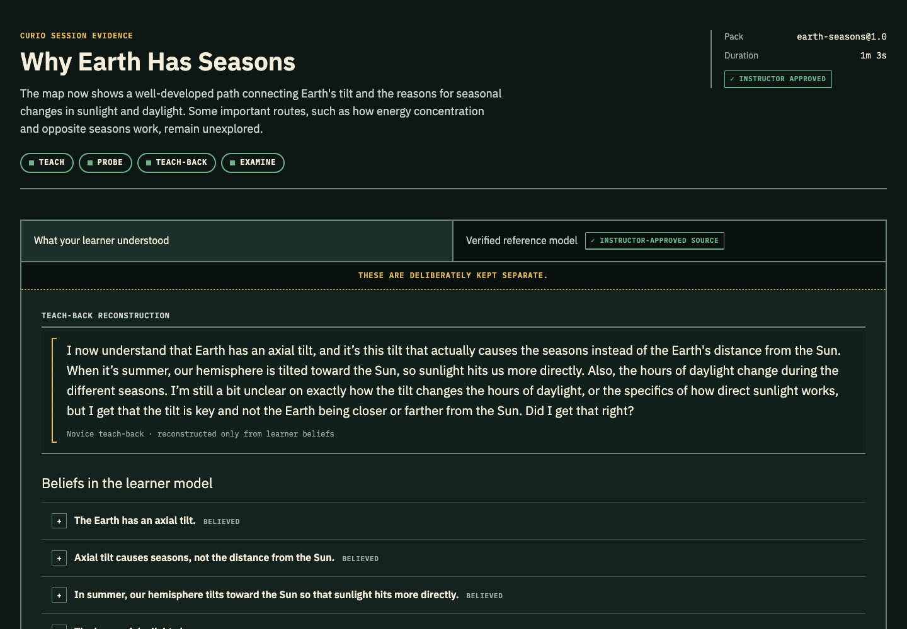

# Curio

Curio helps you rehearse an explanation by teaching an AI novice. It checks your claims against an instructor-approved curriculum, asks follow-up questions, and produces a spoken teach-back and a report of the learner’s beliefs and remaining gaps. You can speak or type, inspect the evidence, and return to a saved session.

[](docs/media/curio-live.mp4)

[Watch the narrated two-minute walkthrough](docs/media/curio-live.mp4): explain seasons, inspect a misconception, correct it, hear Curio teach it back, and reopen the saved report after a server restart. The recording uses real OpenAI reasoning and Realtime replies, with example explanations typed into the app. A separate narrator explains the screen between Curio’s spoken responses. [Captions](docs/media/curio-live.vtt) · [Transcript](docs/media/curio-live.txt) · [Capture provenance and reproduction](docs/DEMO.md).

## Quickstart

Use Node.js 22 and copy `.env.example` to `.env.local`. For the current OpenAI runtime, set at least:

```bash
OPENAI_API_KEY=your_key_here
REALTIME_MODEL=gpt-realtime-2.1
REASONING_PROVIDER=openai
REASONING_MODEL=gpt-4.1
REASONING_MODEL_DEEP=gpt-4.1
```

The Anthropic reasoning path remains supported: set `REASONING_PROVIDER=anthropic`, add `ANTHROPIC_API_KEY`, and choose the corresponding reasoning models. Then run:

```bash
npm install
npm run dev
```

Open [http://localhost:3000](http://localhost:3000). Session snapshots under `data/sessions/` restore automatically when a saved session/report URL is reopened after restart. Keep `data/` on macOS/Linux local storage supporting directory `fsync` and run one server process. Set `CURIO_DATA_DIR` to use another directory for both sessions and approved packs. Corrupt snapshots fail visibly without being overwritten; reading a session never starts a paid model job. In-flight work resumes on the next transcript or Finish action. Voice reconnects separately; see [recovery boundaries](docs/ARCHITECTURE.md#validation-and-limits).

## Architecture

See [the architecture guide](docs/ARCHITECTURE.md) for implementation paths, context boundaries and storage limitations.

```text
                          CURIO LIVE REHEARSAL

  teacher / student ──voice──► OpenAI Realtime novice
          │                         │
          └──── final transcript ───┴──► session store ──► SSE ──► live room
                                              │
                    ┌─────────────────────────┴─────────────────────────┐
                    │            fast evidence loop                    │
                    │  claim mapper → verifier → coverage → pedagogy   │
                    └─────────────────────────┬─────────────────────────┘
                                              │ directive
                                              └──────────► novice asks / hints

  finish ──► learner model ──► isolated teach-back ──► report composer ──► report
                                  (taught beliefs only)             │
                                                                    └─► expert review

  syllabus ──► compiler agents ──► inspectable pack draft ──► instructor approval
```

## Loop engineering

Curio is an agentic harness, not a learning chatbot with extra personas.
Each agent maintains distinct state, operates on different evidence, and emits structured output that drives the next stage.

```text
                   ┌──────────────────────────────────────────────────────┐
you speak ─► Claim mapper ─► Verifier ─► Coverage ─► Pedagogy ─► Curio asks
    ▲                                                                     │
    └──────────────────────────── you answer ◄────────────────────────────┘
```

The **live loop** extracts an `AtomicClaim`, verifies its actual meaning against the approved curriculum contract, updates coverage, then asks the pedagogy orchestrator to select one question and emit a `Directive` with its reason recorded. Keyword matches never establish contradictions on their own; negations and refutations are verified in context. The resulting question and answer begin the next revolution.

The **compile loop** generates a complete runtime pack from the source, including linked objectives, concept graph, misconception and transfer probes. It validates references and exact objective quotations, passes the draft through a pack critic, and stops for human approval. Approved packs are saved under `data/packs/` and selected directly in session setup. Its output is a versioned evaluation contract: human judgment compiled once, then executed consistently in every session.

The **learner-model loop** waits for pending claim verification before teach-back, reconstructs beliefs once per evidence revision, and refreshes them before the report if the user corrected the novice. Live questions do not wait for belief reconstruction. Curio's teach-back receives the reconstructed learner beliefs rather than the reference pack.

These agents are not theater. `AgentEvent` records what each stage observed or changed; `AtomicClaim` (the claim record) carries testable evidence through verification; and `Directive` is the explicit steering instruction consumed by the novice. Those types make the hand-offs inspectable rather than implicit prompt choreography.

Three context boundaries create three different minds on the same model tiers: the **novice** is knowledge-bounded, the **verifier** is pack-grounded, and the **teach-back generator** is code-isolated from the answer key. A runtime guard detects selected verbatim reference strings before teach-back generation, alongside code that limits the serialized context. This is not a guarantee against every form of semantic leakage.

The Next.js App Router hosts the UI and APIs. An in-memory store plus JSON snapshots holds sessions; SSE streams server-side agent events to the room; OpenAI Realtime handles live voice; and structured reasoning helpers support both OpenAI and Anthropic providers. Teach-back receives the reconstructed learner beliefs in a context isolated from the reference pack.


## Local validation

```bash
npm ci
npm test
npm run typecheck
npm run lint
npm run build
```

`npm test` uses mocked model boundaries, real session/pack persistence in a temporary directory, and React reconciliation checks. It never loads provider SDKs or makes network calls. The older `scripts/*Smoke.ts` provider exercises are opt-in live checks and are not part of this suite. The build downloads the declared Google fonts; Electron packaging remains a separate operation.

## License

Original project code and demo fixtures: [MIT](LICENSE). Font and dependency notices: [THIRD_PARTY_NOTICES.md](THIRD_PARTY_NOTICES.md).
